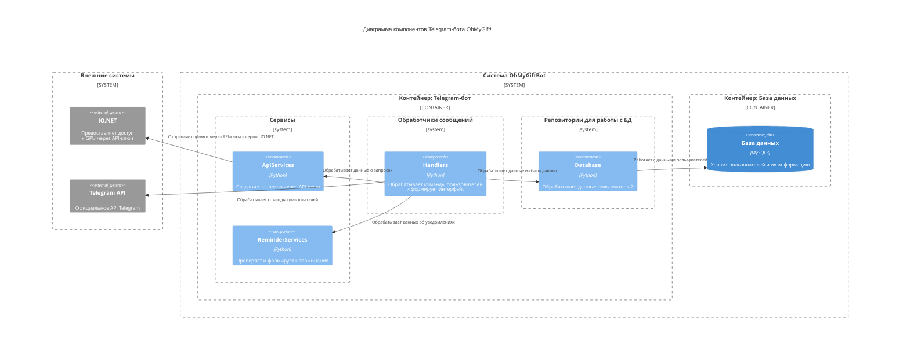

# Диаграмма компонентов
Диаграмма компонентов показывает внутреннюю структуру контейнера, разбивая его на логические компоненты (модули, классы, сервисы) и связи между ними.

Диаграмма отображает внутреннюю структуру системы на уровне компонентов. Система разделена на два основных контейнера:
1. Контейнер Telegram-бота содержит логические блоки:

    - Обработчики — принимают callback-запросы и маршрутизируют их:
        - Handler: реагирует на вопросы пользователей;

    - Репозитории — получают и сохраняют данные в базу:
        - Database: сохраняет и извлекает информацию о пользователях Telegram;

    - Сервисы — вспомогательные компоненты, реализующие бизнес-логику:
        - ApiServices: Отвечает за обработку данных для отправления через API-ключ в сервис IO.NET.
        - ReminderServices: Отвечает за проверку и создание напоминаний, уведомлений о событиях.

2. Контейнер базы данных
    - MySQL3 — централизованное хранилище всех личных и глобальных данных пользователей.

Взаимодействие с внешними системами
- Telegram API — для отправки/получения сообщений и callback-запросов.
- IO.NET — предоставляет GPU для обработки промптов через API-ключ.