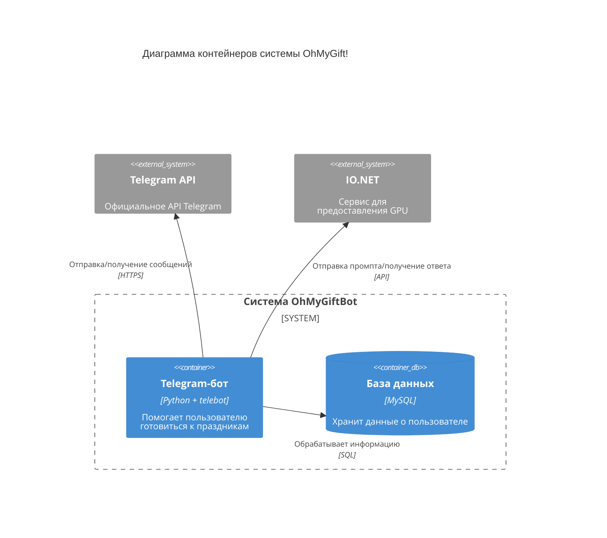

# Диаграмма контейнеров
Диаграмма контейнеров C4 показывает высокоуровневую архитектуру системы, выделяя основные подсистемы внутри границ рассматриваемой системы и их взаимодействие с внешними системами.

## Описание контейнеров:
1. Telegram-бот (Python + telebot):
- Добавление дней рождений и праздников
- Просмотр списка предстоящих событий
- Напоминания за 1, 7 дней и в день события
- Настройка параметров уведомлений
- Профили с дополнительной информацией
- Возможность добавлять заметки, поздравления и подарки
- Генерация поздравлений и идей для подарков на основе информации об имениннике
2. База данных (MySQL):

Основывается на сведениях, предоставленных пользователем и содержит данные о:
- Днях рождения
- Пользовательских праздниках
- Глобальных праздниках
- Параметрах уведомлений
## Внешние системы:
1. Telegram — платформа для работы бота. Обеспечивает коммуникацию с пользователями.
2. IO.NET - децентрализованная платформа, предоставляющая доступ к вычислительным мощностям графических процессоров (GPU) для задач машинного обучения, искусственного интеллекта и рендеринга.