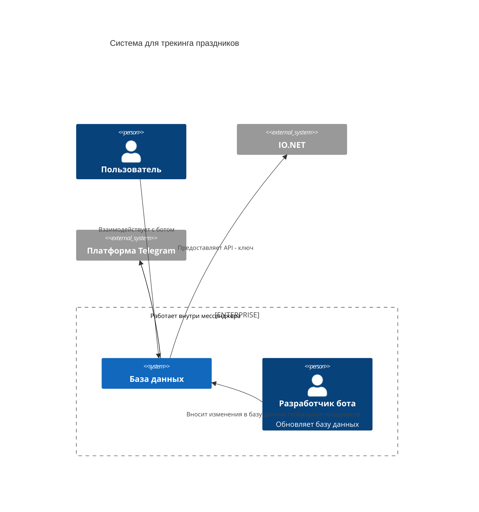

# Диаграмма Контекста
 Диаграмма показывает систему в масштабе ее взаимодействия с пользователями и другими системами.

## Описание компонентов:
1. OhMyGiftBot - Telegram-бот, напоминающий пользователям о приближающихся событиях и помогающий в подготовке к ним.
2. Разработчики бота, которые отвечают за обновление, добавление глобальных праздников в базу данных.

## Внешние системы:
1. Мессенджер Telegram - платформа для работы бота.
2. Сервис IoNet, который предоставляет API для генерации подарков и поздравлений.
3. Список глобальных праздников.

## Взаимодействия:
1. Пользователи вносят основную информацию о празднике и получателе.
2. Бот сохраняет и обрабатывает информацию, при запросе отправляет рекомендации по подаркам и поздравлениям. Присылает уведомления.
3. Разработчики или администраторы обновляют базу данных с глобальными праздниками.