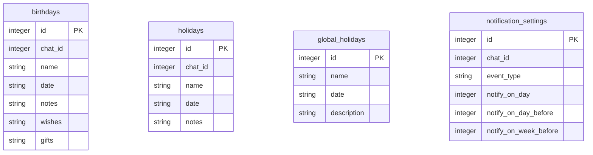

## ER-диаграмма базы данных

## Описание диаграммы
База данных представляет собой систему управления событиями, где:

- birthdays хранит информацию о днях рождения с полями имени, даты, пожеланий и подарков
- holidays хранит информацию о пользовательских праздниках с датой и заметками
- global_holidays хранит информацию о глобальных праздниках с датой и описанием
- notification_settings определяет настройки уведомлений (в день события, за день и за неделю)

Для каждого типа событий в чате, обеспечивая уникальность записей через соответствующие ограничения.
Поле chat_id в таблицах birthdays, holidays и notification_settings указывает на связь с конкретным чатом, что позволяет группировать данные по чатам.
Таблица global_holidays не имеет прямой связи с chat_id, что делает её общим справочником для всех чатов.
В базе данных нет явных внешних ключей, указывающих на строгую связь между таблицами